# D_diagrama_asis.md — Diagrama AS-IS da Jornada do FIES

**Serviço:** Contratação do FIES (Fundo de Financiamento Estudantil) pelo portal acesso.gov.br — MEC/FNDE  
**Formato:** Diagrama mermaid (flowchart) + tabela de atores com relações explícitas  

---

## Diagrama da Jornada (Mermaid)

```mermaid
flowchart TD
    %% ATORES
    Estudante([🎓 Estudante])
    GovBR[Portal Gov.br\nAutenticação]
    Portal[Portal de Acesso Único\nacessounico.mec.gov.br/fies]
    INEP[(Base INEP\nNotas ENEM)]
    CadUnico[(CadÚnico\nMDS)]
    RecFed[(Receita Federal\nValidação CPFs)]
    FiesSel[Sistema FiesSeleção\nMEC/FNDE]
    CPSA[CPSA da IES\nComissão de Validação]
    SisFIES[SisFIES-Gestão /\nSIFESWeb]
    Banco[Agente Financeiro\nCaixa / Banco do Brasil]
    AppFIES[App FIES CAIXA\nContratação Digital]
    Seguradora[Seguradora\nMapfre / Wiz / Caixa Seg.]
    FGFies[FG-Fies\nFundo Garantidor]
    FNDE[FNDE\nRepasse CFT-E]
    IES[Mantenedora IES\nInstituição de Ensino]
    TCU[TCU / CGU\nControle e Auditoria]

    %% ETAPA 1 — INSCRIÇÃO
    Estudante -->|1. Acessa o portal| GovBR
    GovBR -->|Autentica via login único| Portal
    Portal -->|Consulta notas ENEM via CPF| INEP
    Portal -->|Consulta elegibilidade FIES Social| CadUnico
    Portal -->|Valida CPFs do grupo familiar| RecFed
    Portal -->|Submete inscrição| FiesSel
    FiesSel -->|Gera Comprovante de Inscrição PDF| Estudante

    %% ETAPA 2 — COMPLEMENTAÇÃO
    FiesSel -->|Divulga pré-seleção| Estudante
    Estudante -->|2. Complementa dados no painel| FiesSel
    FiesSel -->|Calcula percentual e encargos| Estudante

    %% ETAPA 3 — VALIDAÇÃO CPSA
    Estudante -->|3. Envia documentos ou comparece| CPSA
    CPSA -->|Confere dados no sistema| SisFIES
    SisFIES -->|Valida elegibilidade acadêmica| CPSA
    CPSA -->|Emite DRI aprovado| Estudante
    CPSA -->|Transmite DRI ao banco via sistema| SisFIES
    SisFIES -->|Disponibiliza DRI ao agente financeiro| Banco

    %% FAIL POINT CRÍTICO — CPSA
    CPSA -->|⚠ FAIL POINT CRÍTICO\nIndeferimento por doc. informal\nprazo 5 dias insuficiente| FP_CPSA[/❌ Perda da vaga/]

    %% ETAPA 4 — FORMALIZAÇÃO BANCÁRIA
    Estudante -->|4a. Sem fiador: contratação digital| AppFIES
    Estudante -->|4b. Com fiador: vai à agência| Banco
    AppFIES -->|Biometria e envio de docs| Banco
    Banco -->|Processa garantia para FIES Social| FGFies
    Banco -->|Processa fiança convencional/solidária| FGFies
    Banco -->|Emite apólice do seguro| Seguradora
    Banco -->|Formaliza contrato CCB| Estudante

    %% FAIL POINT BANCÁRIO
    Banco -->|⚠ FAIL POINT\nExigência ilegal doc. físico\nInstabilidade SIFESWeb| FP_Banco[/❌ Bloqueio no balcão/]

    %% ETAPA 5 — RENOVAÇÃO
    Estudante -->|5. Rematrícula e acessa SIFESWeb| SisFIES
    CPSA -->|Inicia aditamento no sistema| SisFIES
    SisFIES -->|Aditamento Simplificado: valida digital| Estudante
    SisFIES -->|Aditamento Não Simplificado: emite DRM| CPSA
    CPSA -->|Entrega DRM ao estudante| Estudante
    Estudante -->|Leva DRM ao banco| Banco

    %% PROCESSOS DE SUPORTE
    FNDE -->|Repassa CFT-E mensalmente| IES
    IES -->|Usa CFT-E para quitar INSS e tributos| RecFed
    IES -->|⚠ FAIL POINT\nIrregularidade fiscal bloqueia CFT-E| FP_CFT[/❌ Aditamentos bloqueados\npara todos os alunos/]

    %% CONTROLE
    TCU -->|Audita SIFESWeb e contratos| Banco
    TCU -->|Audita repasses| FNDE
```

---

## Tabela de Atores com Relações Explícitas

| # | Ator | Tipo | Camada | Relação com outros atores |
|---|---|---|---|---|
| 1 | Estudante | Demandante | Ações do Cidadão | → Autentica via Gov.br → Inscreve-se no Portal → Valida documentos na CPSA → Formaliza contrato com Banco → Renova via SIFESWeb |
| 2 | Portal Gov.br | Sistema | Processos de Suporte | ← Recebe credenciais do Estudante → Autentica acesso ao Portal de Acesso Único |
| 3 | Portal de Acesso Único (MEC) | Sistema | Frontstage | ← Recebe login do Gov.br → Consulta INEP, CadÚnico e Receita Federal → Submete inscrição ao FiesSeleção |
| 4 | Sistema FiesSeleção (MEC/FNDE) | Sistema | Processos de Suporte | ← Recebe inscrição do Portal → Aplica regras de classificação e cotas → Notifica Estudante da pré-seleção → Calcula encargos e percentual |
| 5 | Base INEP | Sistema | Processos de Suporte | ← Consultado pelo Portal via CPF → Fornece notas do ENEM para verificação de elegibilidade |
| 6 | CadÚnico (MDS) | Sistema | Processos de Suporte | ← Consultado pelo Portal via CPF → Confirma ou nega elegibilidade para FIES Social |
| 7 | Receita Federal | Sistema | Processos de Suporte | ← Consultada pelo Portal → Valida CPFs do grupo familiar declarado pelo Estudante |
| 8 | CPSA da IES | Organização / Pessoas | Backstage + Frontstage | ← Recebe documentos do Estudante → Confere dados no SisFIES → Emite DRI ao Estudante → Transmite DRI ao Banco via SisFIES → ⚠ Fail point crítico por interpretação discricionária |
| 9 | SisFIES-Gestão / SIFESWeb | Sistema | Processos de Suporte | ← Usado pela CPSA para validação → Disponibiliza DRI ao Banco → Processa aditamentos → ⚠ Fail point por instabilidade (TCU Acórdão 2513/2022) |
| 10 | Caixa / Banco do Brasil | Organização | Frontstage + Backstage | ← Recebe DRI via SisFIES → Analisa crédito e garantias → Aciona FG-Fies ou fiança → Contrata seguro com Seguradora → Formaliza CCB com Estudante |
| 11 | App FIES CAIXA | Sistema | Frontstage | ← Acionado pelo Estudante sem fiador → Processa biometria e documentos digitais → Encaminha contratação ao Banco |
| 12 | Seguradora | Organização | Backstage | ← Acionada pelo Banco → Emite apólice do Seguro Prestamista obrigatório vinculada ao contrato do Estudante |
| 13 | FG-Fies | Organização | Processos de Suporte | ← Acionado pelo Banco → Garante o crédito para Estudante do FIES Social (dispensa fiador) ou demais perfis com fiança solidária |
| 14 | FNDE | Organização | Processos de Suporte | → Repassa CFT-E mensalmente à Mantenedora → Bloqueia repasse se IES irregular → Fiscalizado pelo TCU |
| 15 | Mantenedora / IES | Organização | Processos de Suporte | ← Recebe CFT-E do FNDE → Usa títulos para quitar INSS e tributos na Receita Federal → ⚠ Fail point: irregularidade fiscal bloqueia aditamentos de todos os alunos |
| 16 | TCU / CGU | Organização | Transversal | → Audita SIFESWeb e contratos do Banco → Audita repasses do FNDE → Emite Acórdão 2513/2022 identificando falhas no sistema |

---

## Legenda

| Símbolo | Significado |
|---|---|
| ⚠ FAIL POINT CRÍTICO | Maior gargalo da jornada — Validação CPSA |
| ⚠ FAIL POINT | Ponto de falha relevante identificado |
| `-->` | Relação direta entre atores ou etapas |
| `→` na tabela | Relação de saída (o ator age sobre outro) |
| `←` na tabela | Relação de entrada (o ator recebe de outro) |
| `[(base)]` | Base de dados / sistema |
| `[/texto/]` | Resultado negativo (bloqueio ou exclusão) |
