# D_diagrama_asis.md — Diagrama AS-IS da Jornada do FIES

**Serviço:** Contratação do FIES pelo portal acesso.gov.br — MEC/FNDE  
**Formato:** Diagrama mermaid (flowchart) + tabela de atores e relações  

---

## Diagrama da Jornada (Mermaid)

```mermaid
flowchart TD
    %% ATORES
    Estudante([🎓 Estudante])
    GovBR[Portal Gov.br\nAutenticação]
    Portal[Portal de Acesso Único\nacessounico.mec.gov.br/fies]
    INEP[(Base INEP\nNotas ENEM)]
    CadUnico[(CadÚnico\nMDS/DATAPREV)]
    RecFed[(Receita Federal\nValidação CPFs)]
    FiesSel[Sistema FiesSeleção\nMEC/FNDE]
    CPSA[CPSA da IES\nComissão de Validação]
    SisFIES[SisFIES-Gestão /\nSIFESWeb]
    Banco[Agente Financeiro\nCaixa / Banco do Brasil]
    AppFIES[App FIES CAIXA\nContratação Digital]
    Seguradora[Seguradora\nMapfre / Wiz / Caixa Seg.]
    FGFies[FG-Fies\nFundo Garantidor]
    FNDE[FNDE\nRepasse CFT-E]
    IES[Mantenedora IES\nInstituição de Ensino]
    TCU[TCU / CGU\nControle e Auditoria]

    %% ETAPA 1 — INSCRIÇÃO
    Estudante -->|1. Acessa o portal| GovBR
    GovBR -->|Login único autenticado| Portal
    Portal -->|Consulta notas ENEM via CPF| INEP
    Portal -->|Consulta elegibilidade FIES Social| CadUnico
    Portal -->|Valida CPFs do grupo familiar| RecFed
    Portal -->|Submete inscrição| FiesSel
    FiesSel -->|Gera Comprovante de Inscrição PDF| Estudante

    %% ETAPA 2 — COMPLEMENTAÇÃO
    FiesSel -->|Divulga pré-seleção chamada única| Estudante
    Estudante -->|2. Acessa painel e complementa dados| FiesSel
    FiesSel -->|Calcula percentual de financiamento\nResolução CG-FIES nº 63-2025| Estudante
    FiesSel -->|Gera Comprovante de Complementação| Estudante

    %% ETAPA 3 — VALIDAÇÃO CPSA
    Estudante -->|3. Envia documentos ou comparece| CPSA
    CPSA -->|Acessa sistema e confere dados| SisFIES
    SisFIES -->|Valida elegibilidade acadêmica| CPSA
    CPSA -->|Aprova e emite DRI| Estudante
    CPSA -->|Transmite dados do DRI ao banco| SisFIES
    SisFIES -->|Disponibiliza DRI ao agente financeiro| Banco

    %% FAIL POINT CRÍTICO — CPSA
    CPSA -->|⚠ FAIL POINT CRÍTICO\nIndeferimento por doc. de renda informal\nou prazo de 5 dias insuficiente| FP_CPSA[/❌ Perda da vaga\npor exclusão abrupta/]

    %% ETAPA 4 — FORMALIZAÇÃO BANCÁRIA
    Estudante -->|4a. Sem fiador: contratação digital| AppFIES
    Estudante -->|4b. Com fiador: vai à agência| Banco
    AppFIES -->|Biometria e envio de docs digitais| Banco
    Banco -->|Processa garantia FG-Fies\npara FIES Social| FGFies
    Banco -->|Processa fiança convencional\nou solidária para renda geral| FGFies
    Banco -->|Emite apólice do seguro prestamista| Seguradora
    Banco -->|Assina e registra o contrato CCB| Estudante

    %% FAIL POINT BANCÁRIO
    Banco -->|⚠ FAIL POINT\nExigência ilegal de doc. físico\nInstabilidade SIFESWeb TCU 2513-2022| FP_Banco[/❌ Bloqueio no balcão\nou timeout no sistema/]

    %% ETAPA 5 — RENOVAÇÃO / ADITAMENTOS
    Estudante -->|5. Realiza rematrícula e acessa SIFESWeb| SisFIES
    CPSA -->|Inicia aditamento no sistema| SisFIES
    SisFIES -->|Aditamento Simplificado: valida digital| Estudante
    SisFIES -->|Aditamento Não Simplificado:\nemite DRM físico| CPSA
    CPSA -->|Entrega DRM impresso ao estudante| Estudante
    Estudante -->|Leva DRM ao banco para termo aditivo| Banco

    %% REPASSE FNDE → IES (Processos de Suporte)
    FNDE -->|Repassa CFT-E mensalmente| IES
    IES -->|Usa CFT-E para quitar INSS e tributos| RecFed

    %% FAIL POINT SUPORTE
    IES -->|⚠ FAIL POINT\nIrregularidade fiscal bloqueia CFT-E| FP_CFT[/❌ Aditamentos bloqueados\npara todos os alunos da IES/]

    %% CONTROLE E AUDITORIA
    TCU -->|Audita SIFESWeb e contratos\nAcórdão 2513-2022| Banco
    TCU -->|Audita repasses e conformidade| FNDE
```

---

## Tabela de Atores e Relações

| # | Ator | Tipo | Camada no Blueprint | Relação Principal |
|---|---|---|---|---|
| 1 | Estudante | Demandante | Ações do Cidadão | Inicia e conduz toda a jornada de contratação |
| 2 | Portal Gov.br | Sistema | Processos de Suporte | Autentica o estudante via login único |
| 3 | Portal de Acesso Único (MEC) | Sistema | Frontstage | Ponto de entrada oficial da inscrição |
| 4 | Sistema FiesSeleção (MEC/FNDE) | Sistema | Backstage | Processa inscrições, classificações e complementações |
| 5 | Base INEP | Sistema | Processos de Suporte | Fornece notas do ENEM para verificação de elegibilidade |
| 6 | CadÚnico (MDS) | Sistema | Processos de Suporte | Verifica elegibilidade para o FIES Social |
| 7 | Receita Federal | Sistema | Processos de Suporte | Valida CPFs do grupo familiar |
| 8 | CPSA da IES | Organização / Pessoas | Backstage + Frontstage | Valida documentos e emite o DRI — ⚠ fail point crítico |
| 9 | SisFIES-Gestão / SIFESWeb | Sistema | Backstage + Processos de Suporte | Plataforma de gestão integrada entre IES e banco |
| 10 | Caixa Econômica Federal / Banco do Brasil | Organização | Frontstage + Backstage | Formaliza o contrato e opera o crédito estudantil |
| 11 | App FIES CAIXA | Sistema | Frontstage | Canal de contratação digital para estudantes sem fiador |
| 12 | Seguradora (Mapfre, Wiz, Caixa Seg.) | Organização | Backstage | Emite apólice do Seguro Prestamista obrigatório |
| 13 | FG-Fies (Fundo Garantidor) | Organização | Processos de Suporte | Garante o crédito para estudantes do FIES Social |
| 14 | FNDE | Organização | Processos de Suporte | Repassa CFT-E mensalmente às mantenedoras das IES |
| 15 | Mantenedora / IES | Organização | Processos de Suporte | Recebe CFT-E e quita obrigações fiscais — ⚠ fail point de suporte |
| 16 | TCU / CGU | Organização | Transversal | Audita contratos, sistemas e repasses — Acórdão 2513/2022 |

---

## Legenda

| Símbolo | Significado |
|---|---|
| ⚠ FAIL POINT CRÍTICO | Ponto de falha que mais derruba estudantes na jornada (Validação CPSA) |
| ⚠ FAIL POINT | Ponto de falha relevante identificado na pesquisa |
| `-->` | Relação direta entre atores ou etapas |
| `[(base)]` | Sistema ou base de dados |
| `[/texto/]` | Resultado negativo (exclusão ou bloqueio) |
