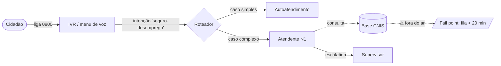

# Exercício 3.1 — Service Blueprint AS-IS de um Serviço Público

> **Disciplina:** IDP-TD 2026 · **Peso:** 100 pontos · **Tempo estimado:** 4–5h
> **Pré-requisitos:** exercício 2.1 concluído; conta em pelo menos **dois**
> assistentes de IA conversacionais (ChatGPT / Gemini / Claude.ai) e Claude Code
> instalado localmente com a skill `grill-me`.

---

> **⚠ Escolha do serviço.** Este tutorial usa o **Atendimento ao
> Seguro-Desemprego pela URA da Caixa** ([vídeo](https://youtu.be/FSAbbH5Yx4s))
> como serviço-exemplo do início ao fim. O ideal é **continuar o mesmo serviço
> que você mapeou no exercício 2.1** — o mapa de atores de lá vira matéria-prima
> do blueprint aqui. Mas você **pode escolher outro serviço público** que
> conheça melhor (ex.: emissão de passaporte, agendamento no SUS, matrícula na
> rede pública, licenciamento de veículo, CadÚnico). Se trocar, **todos os
> exemplos abaixo — meta-prompt, transcript, blueprint, diagrama — passam a ser
> ILUSTRATIVOS**: adapte-os ao seu serviço. A rubrica avalia se você **mapeou um
> serviço concreto e nomeado** com as camadas do blueprint corretas e um
> diagrama consistente — **não** qual serviço você escolheu.

## 1. Contexto

No 2.1 você descobriu **quem** está na jornada de um serviço público (o mapa de
atores). Agora você vai mapear **como o serviço opera hoje** — a coreografia
entre o que o cidadão vê e a engenharia oculta que sustenta a experiência. O
resultado é o **Service Blueprint AS-IS**: o retrato fiel do serviço como ele é,
com seus pontos de falha à mostra.

A ferramenta é o **Service Blueprint** (G. Lynn Shostack, 1984): uma matriz que
"abre o capô" do serviço em faixas horizontais (*swim lanes*) separadas por
linhas divisórias. Acima da **Linha de Visibilidade** está o *Frontstage* (o
palco que o cidadão vê); abaixo, o *Backstage* (os bastidores). Como diz a
aula: **tornar o invisível, visível** é o que permite agir sobre o caos antes
ocultado — os *fail points*, as redundâncias, as "gambiarras" que o cidadão
inventou para suprir as falhas do Estado.

> Este é o **AS-IS** — o diagnóstico. O redesenho **To-Be** (com plataformas
> gov.br) é assunto de um exercício posterior; aqui o foco é retratar a
> realidade com honestidade, não idealizá-la.

**Atenção**: num contexto real, você entrevistaria os servidores de bastidor e
observaria a jornada presencialmente. A IA não resolve o problema de falta de
contexto — ela só estrutura o que você já sabe e pesquisa o que é público.

## 2. Objetivos de aprendizagem

Ao final, você será capaz de:

- **Escrever um meta-prompt** que produza deep research estruturada para
  sustentar um blueprint (não perguntas avulsas).
- **Operar deep research adversária** — usar um segundo assistente para refutar
  e triangular o primeiro, em vez de tratar uma única resposta como verdade.
- **Estruturar um serviço** nas camadas do Service Blueprint (Evidências
  Físicas, Ações do Cidadão, Frontstage, Backstage, Processos de Suporte) e nas
  linhas divisórias (interação, visibilidade, interação interna).
- **Começar pela ótica de quem consome**, não de quem opera — fugindo da
  "miopia corporativa" que mapeia do balcão para dentro.
- **Identificar fail points** que somem dos fluxogramas oficiais e **diagramar**
  a jornada de forma que as relações entre etapas e atores fiquem explícitas.

## 3. Entregáveis

Crie um repositório GitHub público com **exatamente** estes nove arquivos na
raiz (nomes e capitalização importam — o autograder valida path-a-path):

| Arquivo | Conteúdo | Tamanho mínimo |
|---|---|---|
| `A_meta_prompt.md` | O meta-prompt que você usou na parte A | ≥ 200 palavras |
| `B_relatorio_assistente_v1.md` | Deep research da **operação atual** pelo **assistente 1** | ≥ 300 palavras |
| `B_relatorio_auditoria_v1.md` | Auditoria da v1 pelo **assistente 2** | ≥ 300 palavras |
| `B_relatorio_assistente_v2.md` | Revisão do **assistente 1** após a auditoria_v1 | ≥ 300 palavras |
| `B_relatorio_auditoria_v2.md` | Segunda auditoria da v2 pelo **assistente 2** | ≥ 300 palavras |
| `B_relatorio_assistente_v3.md` | Versão final do **assistente 1** após audit_v2 | ≥ 300 palavras |
| `C_grill_transcript.md` | Cópia integral da sessão `/grill-me` | ≥ 6 rodadas |
| `C_blueprint_asis.md` | Service Blueprint **AS-IS** (5 camadas + linhas + fail points) | ≥ 5 etapas |
| `D_diagrama_asis.md` | Diagrama da jornada (mermaid) a partir da Parte C | relações explícitas |

> **Nomes idênticos aos da tabela.** O coletor é `path-strict` — `a_meta_prompt.md`
> (minúsculo) ou `C_blueprint_As-Is.md` (capitalização/hífen diferentes) contam
> como ausentes.

Coloque também um `README.md` curto na raiz com seu nome completo e um índice
clicável para os 9 arquivos (use o `README_modelo_3.1.md` como base). Crie o
marcador `.autograde-exercise` com o conteúdo `3.1` (uma única linha) — assim
`autograde validar` detecta o exercício automaticamente.

---

## 4. Tutorial passo a passo

### Parte A — Meta-prompt (≈ 30 min)

**O que é um meta-prompt:** um prompt que instrui o assistente a elaborar um
prompt por você. Aqui o objetivo é coletar **contexto sobre a operação do
serviço** para sustentar o blueprint AS-IS — não apenas a visão de quem usa, mas
os bastidores, as evidências físicas, os normativos e os fail points conhecidos.
Se possível, anexe o que você já produziu no 2.1 (o mapa de atores).

**Passo a passo:**

1. **Abra o assistente 1**: recomendo Gemini, Claude ou ChatGPT com Deep
   Research ativado.
2. **Escreva seu meta-prompt:** descreva o serviço (qual, qual canal, qual
   órgão), peça uma pesquisa estruturada que sustente um Service Blueprint
   AS-IS: (a) as etapas da jornada na **ótica do cidadão**, (b) os processos de
   **bastidor** (quem faz o quê fora da vista), (c) as **evidências físicas** de
   cada etapa, (d) os **normativos** aplicáveis, e (e) os **fail points**
   conhecidos.
3. **Salve** o meta-prompt em `A_meta_prompt.md`. Esse é o entregável de A —
   não o resultado dele.

### Parte B — Deep research adversarial (≈ 90 min)

Mesma mecânica do 2.1 (auditoria iterativa entre dois assistentes), mas o tema
é **como o serviço opera hoje**. Essa pesquisa é a matéria-prima do blueprint da
Parte C.

**Pipeline (5 arquivos):**

```
v1 → audit_v1 → v2 → audit_v2 → v3
```

**Pré-requisito:** o meta-prompt de A está pronto e o assistente 1 já respondeu.

B1. **Pesquisa inicial** — copie o prompt de `A_meta_prompt.md` e cole no chat
do assistente 1. Cole a resposta integral em `B_relatorio_assistente_v1.md`
(≥ 300 palavras).

B2. **Peça uma AUDITORIA no assistente 2** (modelo *diferente* — não outra
sessão do mesmo modelo):

```
Vou te enviar uma pesquisa que outro assistente de IA produziu sobre a
OPERAÇÃO do serviço público [seu serviço]. Faça uma AUDITORIA RIGOROSA.
Identifique TODAS as falhas:
  - erros factuais (cite o trecho)
  - etapas de bastidor (backstage) omitidas
  - evidências físicas ou normativos relevantes que ficaram de fora
  - fail points não identificados
  - inferências mal-suportadas / fontes fracas
NÃO conte como falha questões cosméticas (formatação, estilo, ordem).
Para cada falha, cite o trecho e justifique.

PESQUISA A AUDITAR:
"""
[colar v1 aqui]
"""
```

Cole em `B_relatorio_auditoria_v1.md` (≥ 300 palavras).

B3. **Volte ao assistente 1** com a auditoria:

```
Você fez uma pesquisa que submeti a auditoria por outro assistente. Segue a
auditoria. Produza uma v2 ABORDANDO CADA falha — para cada uma escolha:
  (a) corrigir com texto novo,
  (b) defender com argumento e evidência, ou
  (c) marcar explicitamente como pendente / em-aberto.
NÃO ignore falhas.

AUDITORIA:
"""
[colar audit_v1 aqui]
"""
```

Cole em `B_relatorio_assistente_v2.md` (≥ 300 palavras).

B4. **Segunda auditoria no assistente 2** sobre a v2:

```
Esta é a v2 de uma pesquisa que você auditou (audit_v1). Faça uma SEGUNDA
auditoria verificando: (a) se cada falha do audit_v1 foi de fato endereçada,
(b) se a v2 introduziu falhas novas, (c) se restam pontos abertos.
Continue rigoroso — não amenize por gentileza.

v2 A AUDITAR:
"""
[colar v2 aqui]
"""
```

Cole em `B_relatorio_auditoria_v2.md` (≥ 300 palavras).

B5. **Volte ao assistente 1** para a versão final, abordando os pontos restantes
do audit_v2. Cole em `B_relatorio_assistente_v3.md` (≥ 300 palavras).

**Critérios não-negociáveis (a rubrica zera se faltar):**

- **`audit_v1` substantiva (B10):** ≥ 1 falha REAL identificada.
- **`v2` ABORDA a `audit_v1` (B11):** cada falha tem tratamento (a/b/c).
- **`v3` evolui sobre v2 com gatilho da `audit_v2` (B12):** cada delta cita o
  ponto da audit_v2 que o motivou.

**Dois assistentes DIFERENTES (modelos subjacentes distintos):** Gemini ≠
ChatGPT ≠ Claude. ChatGPT-4 vs ChatGPT-4o **não** conta.

### Parte C — Service Blueprint AS-IS via `/grill-me` (≈ 75 min)

O `/grill-me` entrevista você adversarialmente, **uma pergunta por vez**, até
reduzir ambiguidades. Aqui você usa para destilar a pesquisa B em um **Service
Blueprint AS-IS decidido** — não uma colagem.

**Passo a passo:**

1. **Abra um terminal** no diretório do repositório (`cd` onde estão `A_*`,
   `B_*`).
2. **Inicie o Claude Code:** `claude`.
3. **Cole um prompt igual ou semelhante a este** (substitua `<RELATORIO V3>`
   pelo seu relatório):

   ```
   /grill-me

   Quero elaborar conceitualmente um Service Blueprint AS-IS da jornada
   "Atendimento ao Seguro-Desemprego pela URA da Caixa". Considere como
   contexto o artefato @<RELATORIO V3>. Siga a metodologia de Service
   Blueprint de Shostack: camadas (Evidências Físicas, Ações do Cidadão,
   Frontstage, Backstage, Processos de Suporte), as linhas divisórias
   (interação, visibilidade, interação interna) e os fail points.
   ```

4. **Responda cada pergunta** — não pule, não responda "tanto faz", não peça
   para o Claude decidir por você. O ponto é *você* decidir onde está a Linha de
   Visibilidade, quais etapas são fail points e em que camada cada ator opera.
5. **Salve o transcript completo** em `C_grill_transcript.md` (perguntas E suas
   respostas). Mínimo **6 rodadas**. Se o Claude encerrar antes, peça para
   continuar com novos eixos (ex.: "e quanto à etapa de autenticação?").
6. **Produza o Blueprint AS-IS** em `C_blueprint_asis.md`.

#### Formato do `C_blueprint_asis.md`

Use **tabela** (recomendado). Mapeie **≥ 5 etapas** na ótica do cidadão, com as
cinco camadas e marcando os **fail points**:

```markdown
## Service Blueprint AS-IS — [seu serviço]

| Camada \ Etapa | 1. Liga | 2. Navega URA | 3. Autentica | 4. Aguarda fila | 5. Atendimento |
|---|---|---|---|---|---|
| **Evidências Físicas** | tom de chamada | menu de voz | — | música de espera | voz do atendente |
| **Ações do Cidadão** | disca 0800 | escolhe opção | informa CPF/NIS | espera | explica o caso |
| — *Linha de Interação* — | | | | | |
| **Frontstage** (visível) | gravação | IVR | IVR valida | — | atendente N1 |
| — *Linha de Visibilidade* — | | | | | |
| **Backstage** (invisível) | — | roteador | consulta base CNIS | discador preditivo | abre chamado |
| — *Linha de Interação Interna* — | | | | | |
| **Processos de Suporte** | telefonia | — | sistema CNIS | dimensionamento | CRM / retaguarda |
| **⚠ Fail points** | | menu confuso | **base fora do ar** | **fila > 20 min** | transbordo manual |
```

> **Mínimo:** 5 etapas distintas na ótica do cidadão. Marque ≥ 1 fail point.
> Cada etapa/ator do blueprint deve aparecer no `C_grill_transcript.md`
> (a rubrica cruza os dois).

### Parte D — Diagrama da jornada (≈ 30 min)

A partir dos itens identificados na Parte C, elabore um **diagrama** que torne
visíveis as **relações** entre etapas e atores — não uma lista solta. Use
**mermaid** (renderiza direto no GitHub), em `D_diagrama_asis.md`.

```markdown
## Diagrama AS-IS — [seu serviço]


```

> **A rubrica do diagrama (D)** exige **relações explícitas** entre os nós
> (setas `-->` do mermaid, ou RACI completo, ou prosa estruturada de handoffs).
> Um diagrama que é só uma lista de caixas sem ligações **não** pontua. Os nós
> devem refletir as etapas/atores da Parte C.

---

## 5. Validação local e submissão

> **⚠ Atualize o `autograde` antes de validar.** Exercícios novos podem exigir a
> versão mais recente do CLI. Se você **já** tinha o `autograde` instalado, rode
> `git pull && pip install -e .` no seu clone do `autograde-idp` antes de validar
> (instalação nova já vem atualizada).

```bash
# 1. Garanta que está no diretório raiz do repo do exercício (adapte ao seu)
cd ~/exercicio-3.1

# 2. Verifique os arquivos
ls A_*.md B_*.md C_*.md D_*.md .autograde-exercise

# 3. Rode o autograder (faz preview antes de submeter)
autograde validar 3.1
```

O `autograde validar` vai:
1. Detectar o repo via `git remote.origin.url`.
2. Ler os 9 arquivos e calcular evidência local (existência, palavras, sha256,
   headings).
3. Enviar `artifacts_evidence` + `repo_url` ao backend.
4. Backend roda **checks determinísticos** (16 pts, todos em B) +
   **LLM-as-judge** sobre o conteúdo (84 pts: A=20, B=24, C=28, D=12) contra a
   rubrica abaixo.
5. Mostra boletim. Se aceitar, digite `s` para submeter.

> Limite de previews por dia: 10. Use com critério.

---

## 6. Rubrica (100 pts)

| Parte | Critério | Pts | Como passa |
|---|---|---|---|
| A | `A_meta_prompt_quality` | 20 | serviço nomeado + pede deep research da operação/bastidor/fail points para sustentar o AS-IS |
| B | `B1_iteracoes_distintas` | 4 | v1, v2, v3 distintas (não cópia) |
| B | `B2_auditorias_distintas` | 2 | audit_v1 ≠ audit_v2 |
| B | `B3`–`B7` palavras (300) | 10 | cada relatório ≥ 300 palavras |
| B | `B10_audit_v1_substantiva` | 10 | audit_v1 aponta ≥ 1 falha real na v1 |
| B | `B11_v2_aborda_audit_v1` | 7 | v2 trata cada falha (corrige/defende/abre) |
| B | `B12_v3_evolucao_pos_audit_v2` | 7 | v3 evolui citando gatilhos da audit_v2 |
| C | `C1_rodadas` | 8 | ≥ 6 rodadas reais no `/grill-me` |
| C | `C2_blueprint_asis_qualidade` | 20 | camadas + ≥5 etapas (ótica do cidadão) + fail point + consistência com transcript |
| D | `D_diagrama_relacoes` | 12 | diagrama com relações explícitas (mermaid/RACI/handoffs), não lista solta |

---

## 7. Critérios de "definição de pronto"

Antes de submeter, confirme:

- [ ] `autograde validar 3.1` roda sem erro de schema (os 9 arquivos
      `exists=True` no payload).
- [ ] Cada `assistente_v{1,2,3}` e cada `auditoria_v{1,2}` tem ≥ 300 palavras.
- [ ] As 3 iterações de assistente são distintas e as 2 auditorias também.
- [ ] `audit_v1` aponta ≥ 1 falha REAL (não cosmética).
- [ ] `v2` aborda as falhas da `audit_v1`; `v3` cita gatilhos da `audit_v2`.
- [ ] `C_grill_transcript.md` tem ≥ 6 rodadas de pergunta-resposta.
- [ ] `C_blueprint_asis.md` tem as 5 camadas distinguíveis, ≥ 5 etapas na ótica
      do cidadão e ≥ 1 fail point marcado.
- [ ] Toda etapa/ator do blueprint aparece nominalmente em
      `C_grill_transcript.md`.
- [ ] `D_diagrama_asis.md` é um diagrama com relações explícitas (setas mermaid
      ou equivalente) que reflete os itens da Parte C.
- [ ] `.autograde-exercise` contém só a string `3.1`.
- [ ] README do repo tem seu nome completo e índice dos 9 arquivos.

---

## 8. Dicas e armadilhas comuns

- **Comece pela ótica de quem CONSOME, não de quem opera.** A "miopia
  corporativa" mapeia do balcão para dentro — o cidadão começa a jornada no sofá
  de casa, não no saguão. O blueprint começa onde o cidadão começa.
- **A Linha de Visibilidade é a barreira mais sensível.** É ela que separa o que
  o cidadão vê (Frontstage) do que fica oculto (Backstage). Decidir onde ela
  passa é a decisão central do blueprint.
- **Fail points são o ouro do AS-IS.** Onde o cidadão desiste? Onde a base cai?
  Onde a fila estoura? O blueprint existe para tornar esses pontos visíveis —
  não esconda os problemas.
- **Não gere o blueprint com um único prompt no Claude.** A rubrica cruza
  blueprint ↔ transcript (C2) — blueprint "tirado da cartola" perde pontos.
- **Diagrama é relação, não decoração.** A Parte D vale por mostrar quem se
  conecta com quem (setas), não por ser bonito. Lista de caixas soltas zera o D.
- **Cuidado com PII em transcripts.** Anonimize nomes reais de servidores antes
  de commitar (o repo será público).

---

## 9. Suporte

- Dúvidas conceituais: canal `#idp-2026-exercicios` no Slack.
- Bug no autograder: abra issue em
  [autograde-idp/issues](https://github.com/alexlopespereira/autograde-idp/issues).
- Limite de preview atingido (HTTP 429): aguarde reset à meia-noite BRT; o
  `submission_uuid` é preservado para retry.
